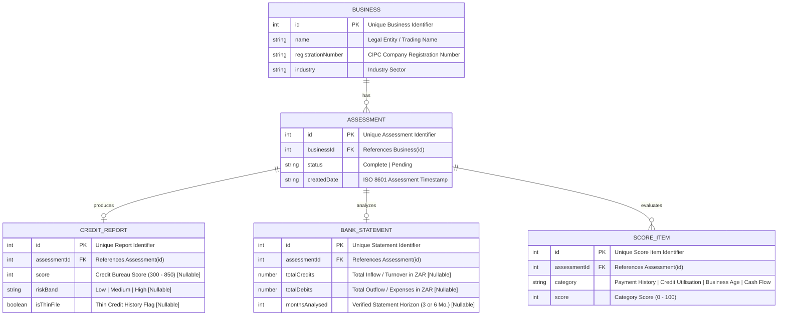

# 🏦 Lula SME Credit Operations & Underwriting Dashboard

> **An enterprise-grade, endpoint-driven credit operations dashboard designed for SME credit analysts and underwriters to evaluate business credit assessments, cash flow liquidity, risk tiers, and qualification decisions.**

---

## 📑 Table of Contents

- [Overview & Purpose](#-overview--purpose)
- [Architecture & Tech Stack](#-architecture--tech-stack)
- [Database Schema & ERD Diagram](#-database-schema--erd-diagram)
- [Getting Started & Running Locally](#-getting-started--running-locally)
- [Core Feature Highlights](#-core-feature-highlights)
  - [1. Executive Operations Overview](#1-executive-operations-overview)
  - [2. Businesses Financial & Credit Deep Dive](#2-businesses-financial--credit-deep-dive)
  - [3. Assessments & Qualification Ranking](#3-assessments--qualification-ranking)
  - [4. Global Debounced Search & Navigation](#4-global-debounced-search--navigation)
  - [5. Underwriting Decision & Handover Bar](#5-underwriting-decision--handover-bar)
- [Automated Testing & QA Suite](#-automated-testing--qa-suite)
- [Design System & CDD Methodology](#-design-system--cdd-methodology)
- [Future Roadmap & Extensibility](#-future-roadmap--extensibility)

---

## 🌟 Overview & Purpose

The **Lula Credit Operations Dashboard** equips underwriting analysts with instant clarity over commercial SME loan applicants. It streamlines the underwriting pipeline by ingesting verified bank statement cash flows, statutory bureau credit scores, and category scoring sub-factors into actionable decision workflows.

### 🎯 Key Capabilities
- **Pure Endpoint Data Architecture**: Zero hardcoded values or mock fallbacks; strictly driven by `json-server` REST endpoints validated at runtime with **Zod**.
- **Dual-Table Operational Flow**: Clearly separates fully indexed credit assessments from pending document ingestion queues.
- **Deep-Dive Cash Flow Analysis**: Visualizes gross inflow (turnover), gross outflow (expenses), net cash velocity, monthly burn rates, and score gauges.
- **Underwriting Decision Handover**: Formal credit committee determination actions (*Approve Facility*, *Request Info*, *Decline*) with covenant notes and confirmation tracking.
- **Scalable Multi-Filter Ranking**: Multi-dimensional filtering across Date Ranges, Credit Score thresholds, Risk Tiers, and Thin-File flags designed for large loan books.

---

## 🛠️ Architecture & Tech Stack

| Layer | Technology | Description |
| :--- | :--- | :--- |
| **Framework** | **React 18.2** | Concurrent mode, hooks, modular functional architecture |
| **Language** | **TypeScript 5.7** | Strict type safety with 100% type coverage and zero `any` |
| **Routing** | **React Router v7** | Client-side routing with `createBrowserRouter` & `RootErrorBoundary` |
| **State & Async Data** | **TanStack Query v5** | Server-state caching, background revalidation, and retry triggers |
| **Schema Validation** | **Zod 3.24** | Runtime API contract validation and nullable-safety schemas |
| **Styling** | **Tailwind CSS v4** | Lula brand token system (Midnight Navy `#0F253B`, Coral `#FF6D63`, Sky `#61B8D8`, Green `#1AAE4E`) |
| **Icons** | **Lucide React** | Consistent, accessible iconography |
| **Unit Testing** | **Vitest 3.0 + RTL** | Fast unit and component test runner with JSDOM |
| **E2E Testing** | **Playwright 1.50** | End-to-end browser user journey verification |
| **Mock Backend** | **json-server 0.17** | Local REST API server on port 3001 |

---

## 📊 Database Schema & ERD Diagram

The underlying data model connects commercial entities with their credit reports, bank statement analytics, and multi-category scoring dimensions:



---

## 🚀 Getting Started & Running Locally

### 1. Prerequisites
- **Node.js**: v18.0.0 or higher (v20+ / v22+ recommended)
- **npm**: v9.0.0 or higher

### 2. Installation
Clone the repository and install all dependencies:
```bash
git clone https://github.com/RealistKilla/credit-operations-dashboard.git
cd credit-operations-dashboard
npm install
```

### 3. Running the Application
The dashboard requires both the mock API server and the Vite dev server running in parallel:

#### Terminal 1 — Start the Mock API Server (Port 3001)
```bash
npm run api
```
*Serves endpoints:*
- `GET http://localhost:3001/businesses`
- `GET http://localhost:3001/assessments`
- `GET http://localhost:3001/creditReports`
- `GET http://localhost:3001/bankStatements`
- `GET http://localhost:3001/scoreItems`

#### Terminal 2 — Start the Frontend Development Server (Port 5173)
```bash
npm run dev
```
Open **[http://localhost:5173](http://localhost:5173)** in your browser.

---

### 4. Build, Typecheck & Verification Commands

```bash
# Run TypeScript compilation check
npm run typecheck

# Run Vitest unit & component test suite
npm test

# Run Vitest in watch mode
npm run test:watch

# Run Playwright End-to-End browser tests
npm run test:e2e

# Build production bundle
npm run build
```

---

## 💡 Core Feature Highlights

### 1. Executive Operations Overview (`/overview`)
- **Top-Level KPI Grid**: Real-time aggregated statistics calculated dynamically from API data:
  - *Total Businesses*: Total registered SMEs.
  - *Completed Assessments*: Indexed credit profiles.
  - *Pending Queue*: Awaiting statement ingestion.
  - *High Risk Flagged*: Businesses requiring senior underwriter review.
  - *Total Turnover*: Cumulative inflow turnover analyzed across the portfolio.
- **Priority Attention Banner**: Instant alert callout flagging accounts requiring immediate intervention (*Bright Construction* high risk, *Echo Tech Solutions* pending).
- **Dual-Table Layout**:
  - **Left Table (2 Columns)**: Fully completed assessments with company details, CIPC registration, date, credit score, risk badge, turnover credits, and inspect links.
  - **Right Table (1 Column)**: Dedicated **Pending Queue** highlighting unassessed businesses with an action-required banner.

---

### 2. Businesses Financial & Credit Deep Dive (`/businesses/:businessId`)
- **Interactive Company Switcher**: Instant dropdown selector to switch between all 5 SMEs.
- **Visual Semi-Circular Score Gauge**: SVG meter rendering credit score on the statutory 300–850 scale with color-coded risk bands.
- **Thin-File Warning Alert**: Prominent notice for accounts with limited credit history (*Bright Construction*).
- **Bank Statement Cash Flow Breakdown**:
  - *Total Inflow (Credits)* & Monthly Average Volume.
  - *Total Outflow (Debits)* & Monthly Average Burn.
  - *Net Cash Flow (`Credits - Debits`)* & Net Cash Margin %.
  - *Proportional Cash Flow Meter*: Inflow vs. Outflow ratio visualization.
- **Category Score Breakdown**: 0–100 index progress meters across 4 dimensions: *Payment History*, *Credit Utilisation*, *Business Age*, and *Cash Flow*.
- **Pending Account Workflow**: Structured 3-step ingestion checklist for unassessed accounts (*Echo Tech Solutions*).

---

### 3. Underwriting Decision & Handover Bar
Located directly under completed business profiles for credit analysts to log determinations:
- **Approve Facility**: Records approval and dispatches handover to disbursements.
- **Request Info**: Sends automated document/bank statement request to the SME.
- **Decline**: Formally logs credit rejection.
- **Rationale Notes Input**: Allows entering covenant conditions or review notes with confirmation alerts.

---

### 4. Assessments & Qualification Ranking (`/assessments`)
Designed to scale seamlessly for large SME credit portfolios:
- **Summary Metrics Bar**: Matching count, Prime / Low Risk, Moderate In-Review, High Risk, Pending, and Filtered Total Turnover.
- **Multi-Filter Engine**:
  - *Date Range*: Presets (*All Time*, *Last 30 Days*, *Last 90 Days*, *Year to Date*) + custom start/end date range pickers.
  - *Credit Score Range*: Preset buttons (*All*, *Prime 700+*, *Standard 500–699*, *Subprime <500*) + manual min/max numerical inputs.
  - *Risk Band Multi-Select*: Pills for *Low*, *Medium*, *High*, and *Pending*.
  - *Thin-File Toggle*: Instant filter for thin-file accounts.
  - *Sorting*: High-to-low/low-to-high by Score, Turnover, Date, or Company Name.
  - *Reset Button*: One-click reset with active filter count badge.
- **Configurable Pagination**: Rows per page selector (10, 25, 50, 100) and page navigation.

---

### 5. Global Debounced Search & Navigation
- **250ms Debounced Query**: Responsive search in the top navigation bar.
- **Autocomplete Company Dropdown**: Displays matching businesses with name, industry, and CIPC number.
- **One-Click Navigation**: Clicking a matching company navigates directly to its deep-dive view.

---

## 🧪 Automated Testing & QA Suite

### 1. Vitest Unit & Integration Suite (`38 Passing Tests`)
- **`formatters.test.ts` (16 Tests)**: ZAR currency formatting, negative balances, zero, null/undefined/NaN safety, percentage decimals, and robust date parsing fallbacks.
- **`schemas.test.ts` (11 Tests)**: Zod runtime validation of business models, completed assessments, and nullable pending records.
- **`useDebounce.test.ts` (2 Tests)**: Rapid state transition debouncing and timer verification.
- **`RiskBadge.test.tsx` (4 Tests)**: Verified label rendering, qualification subtitles, and thin-file tags.
- **`ScoreGauge.test.tsx` (3 Tests)**: Verified score values, range boundaries (300–850), null pending states, and thin-file badges.
- **`ErrorState.test.tsx` (2 Tests)**: Verified error titles, messages, and retry callback execution.

### 2. Playwright End-to-End Suite
- **`e2e/overview.spec.ts`**: Verifies KPI metrics, dual-table layout, and navigation.
- **`e2e/businesses.spec.ts`**: Verifies score gauges, cash flow analytics, thin-file callouts, pending ingestion states, and underwriting decisions.
- **`e2e/assessments.spec.ts`**: Verifies ranked table rendering, score preset filtering (`700+`), thin-file filtering, and live search.

---

## 🎨 Design System & CDD Methodology

The project follows strict **Component-Driven Development (CDD)** principles:
```
src/
├── api/                    # Typed TanStack Query hooks
├── components/
│   ├── layout/
│   │   ├── Header/         # HeaderBrand, HeaderSearch, HeaderActions
│   │   ├── Sidebar/        # SidebarNavButton, SidebarBusinessesDropdown
│   │   └── RootErrorBoundary.tsx
│   └── ui/                 # Atomic design tokens (Card, Button, Badge,
│                           # RiskBadge, ScoreGauge, MetricCard, ErrorState, Skeleton)
├── context/                # SearchContext for shared search state
├── hooks/                  # useDebounce custom hook
├── layouts/                # DashboardLayout shell
├── types/                  # Strict Zod schemas & domain constants
├── utils/                  # Pure cn merger and financial formatters
└── views/
    ├── Overview/           # OverviewMetricsGrid, OverviewAttentionSection,
    │                       # OverviewRecentAssessments, OverviewPendingAssessments
    ├── Businesses/         # BusinessProfileHeader, BusinessCreditScoreCard,
    │                       # BusinessFinancialAnalysis, BusinessCategoryScoreBreakdown,
    │                       # BusinessDecisionActionBar, BusinessPendingState
    └── Assessments/        # AssessmentsSummaryBar, AssessmentsFilterBar,
                            # AssessmentsRankedTable, AssessmentsPagination
```

---

## 🔮 Future Roadmap & Extensibility

If given additional time and production scope, the following enhancements could be introduced:

1. **📄 PDF Underwriting Pack & Committee Export**:
   - Generate a branded, downloadable PDF summary of the credit assessment, bank statement cash flow charts, and analyst notes for credit committee approval packages.
2. **⚡ Real-Time WebSockets / Server-Sent Events (SSE)**:
   - Live stream incoming bank statement ingestion completions, credit bureau score updates, and decision handovers without manual refreshes.
3. **💬 Multi-Analyst Collaborative Notes & Audit Log**:
   - Threaded comment system with timestamps and analyst attribution to track negotiation notes, security covenant adjustments, and historical approval trails.
4. **🔌 Direct South African Credit Bureau Gateways**:
   - Direct API connectors with TransUnion, Experian, and XDS for automated statutory credit pull and director background checks.
5. **📈 AI/ML Cash Flow Default Forecasting**:
   - Machine learning time-series regression models to project 6-month forward cash flows, seasonality dips, and early default probability indices.
6. **📱 Dark Mode & Theme Customization**:
   - Dynamic theme switcher utilizing CSS custom properties for low-light underwriting environments.

---

## 👤 Author & Submission Information
- **Project**: Lula Credit Operations Assessment
- **Repository**: [https://github.com/RealistKilla/credit-operations-dashboard](https://github.com/RealistKilla/credit-operations-dashboard)
- **Collaborator Access**: `neil-lula` invited.
